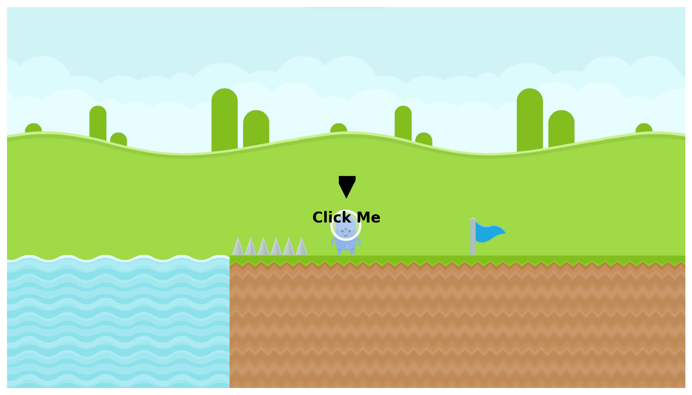

# First Unity Game: 2D Platformer

Welcome to my first Unity game project! This is a 2D platformer that I've been working on as a learning experience. It's not yet complete, but I've made significant progress and wanted to share it with the community.

## About the Game

This game is a classic 2D platformer where the player navigates through various levels, overcoming obstacles and challenges. I've implemented several features and mechanics using C# scripts to bring the game to life.

## Try It Out!

Want to give it a spin? Simply click on the image below to try out the game. Feedback and suggestions are always welcome!

## Feedback

If you have any feedback, suggestions, or would like to contribute to the project, please feel free to open an issue or submit a pull request. I'm always open to collaboration and learning from the community!
